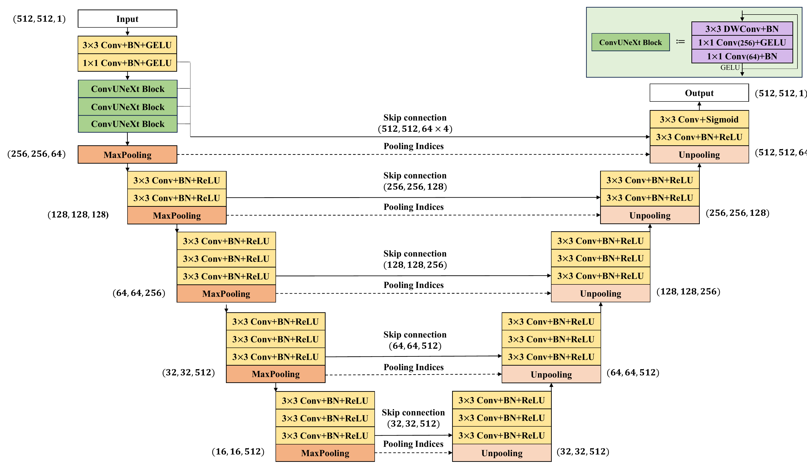

# ReflexNet: Effective encoder-decoder network for pupil light reflex segmentation in facial photographs of ptosis patients
 
## Abstract
This repository contains an official implementation of ReflexNet using PyTorch.<br/>
The paper which includes the detail of this implementation is in the process of being submitted to a scientific journal.

## Model

## Paper
If you use this software for your research, please cite:

```bibtex
@inproceedings{noori2019attention,
  title={Effective encoder-decoder network for pupil light reflex segmentation in facial photographs of ptosis patients},
  author={Sanghyuck Lee, Taekyung Song, Jeong Kyu Lee, and Jaesung Lee},
}
```

## License
This program is available for download for non-commercial use, licensed under the GNU General Public License. This allows its use for research purposes or other free software projects but does not allow its incorporation into any type of commercial software.

## Files
The repository contains the following files:
- `main.py`: Python script file, containing the PyTorch implementation of the training and evaluation process of the ReflexNet.
- `model.py`: Python script file, containing the PyTorch implementation of the ReflexNet.
- `README.md`: Markdown file explaining the model source code.
